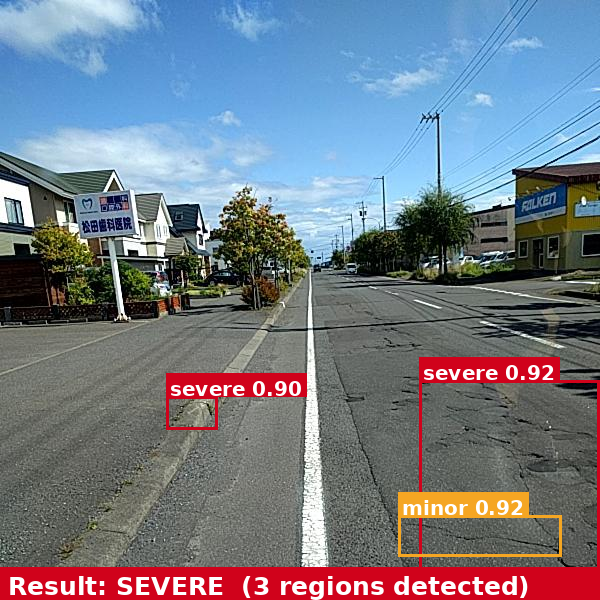

# Road Damage Severity Classifier

3-class road damage severity classifier (normal / minor / severe) on the [RDD2022](https://github.com/sekilab/RoadDamageDetector) dataset, extended into a full detection pipeline for real-world inference on uncropped road images.

## Results

### Phase 1 — Severity Classification (pre-cropped damage regions)

| Experiment | Accuracy | Macro F1 |
|---|---|---|
| SmallCNN baseline | 91.4% | 0.886 |
| SmallCNN + class weights | 61.1% | 0.541 |
| SmallCNN (frozen encoder) | 90.97% | 0.878 |
| SmallCNN (no bbox crop) | 67.2% | 0.581 |
| ResNet50 fine-tuned | **95.7%** | **0.944** |
| ResNet50 (frozen backbone) | 95.1% | 0.936 |

### Phase 2 — Detection Pipeline (full road images, end-to-end)

| | Minor F1 | Severe F1 | Overall Accuracy | Macro F1 |
|---|---|---|---|---|
| YOLOv8s + ResNet50 | 0.606 | 0.830 | **79.5%** | **0.761** |

The gap between 95.7% (clean crops) and 79.5% (full images) reflects the real-world cost of detection uncertainty — missed or imprecise boxes propagate to the classifier.

## How It Works

**Phase 1** trains and compares severity classifiers on pre-cropped bounding box regions. Six experiment variants are evaluated to isolate the effect of architecture, transfer learning, class weighting, and cropping.

**Phase 2** makes the best classifier work on full, uncropped road images:

```
Full image → YOLOv8s (locate damage regions)
           → crop each region
           → ResNet50 (classify severity)
           → worst severity across all regions = final result
No detections → normal
```

A confidence gate (≥0.80) is applied to severe predictions — if the classifier isn't confident enough, the region is downgraded to minor. This reduces false severe predictions on ambiguous crops.

## Sample Predictions

Full pipeline — YOLOv8 detection + ResNet50 severity classification on a single road image:



Classifier comparison — SmallCNN vs ResNet50 on test crops:


## Dataset

[RDD2022](https://www.kaggle.com/datasets/shankarmisra21/road-damage-dataset-rdd2022) — road damage images from Japan, India, and Czech Republic. Damage type → severity mapping:

| Damage Code | Type | Severity |
|---|---|---|
| D00, D01 | Longitudinal crack | minor |
| D10, D11 | Transverse crack | minor |
| D20 | Alligator crack | severe |
| D40 | Pothole | severe |
| (no annotation) | — | normal |

Images are stratified-split 70/15/15 (train/val/test). For classification, the damage bounding box is cropped out and used as the model input. For YOLO training, the full image + box annotations are used.

## Setup

```bash
pip install -r requirements.txt
```

Download RDD2022 from Kaggle and extract to `rdd-dataset/`.

```bash
# Build train/val/test split
python src/data/build_dataset.py

# Crop to bounding boxes (Phase 1 classifier training)
python src/data/build_bbox_crops.py

# Convert to YOLO format (Phase 2 detector training)
python src/data/convert_to_yolo.py
```

## Training

```bash
# Train SmallCNN
python src/train/train_custom.py

# Train ResNet50 transfer learning
python src/train/train_transfer.py

# Train YOLOv8s detector
yolo detect train data=PMA/yolo_data/data.yaml model=yolov8s.pt epochs=50 imgsz=640 batch=16
```

Checkpoints saved to `outputs/model_*/` and `outputs/yolo/detector/weights/`.

## Inference

**Full pipeline — single image (Phase 2):**
```bash
python src/demo/predict_pipeline.py path/to/road_image.jpg --verbose
```

**Classifier only — pre-cropped region (Phase 1):**
```bash
python src/demo/predict.py path/to/crop.jpg --model tl
```

**Classifier comparison grid:**
```bash
python src/demo/predict_grid_compare.py
```

## Evaluation

**End-to-end pipeline:**
```bash
python src/eval/eval_pipeline.py                # full val set
python src/eval/eval_pipeline.py --limit 200    # quick run
python src/eval/eval_pipeline.py --sweep-gate   # tune severity gate threshold
```

Results saved to `outputs/pipeline_eval/`.

## Project Structure

```
PMA/
  src/
    models/custom_cnn.py       # SmallCNN (4-block conv + FC head)
    data/                      # dataset builder, bbox crops, YOLO conversion
    train/                     # training loops (SmallCNN, ResNet50)
    demo/
      predict.py               # Phase 1 — classify a pre-cropped image
      predict_pipeline.py      # Phase 2 — full image inference
      predict_grid_compare.py  # classifier comparison grid
    eval/
      eval_pipeline.py         # Phase 2 — end-to-end evaluation
      predict_unlabeled_testsets.py
    eda/                       # distribution and sample plots
  outputs/
    model_custom/                     # SmallCNN baseline
    model_custom (class weights)/
    model_custom (frozen)/
    model_custom (wo bbox)/
    model_transfer_resnet50/          # best classifier (Phase 1)
    model_transfer_resnet50 (frozen)/
    yolo/detector/                    # YOLOv8 weights + training curves
    pipeline_eval/                    # end-to-end eval results (Phase 2)
```

## Stack

Python · PyTorch · torchvision · Ultralytics YOLOv8 · RDD2022
